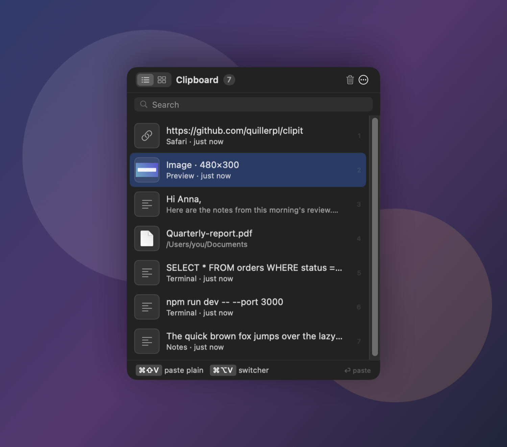
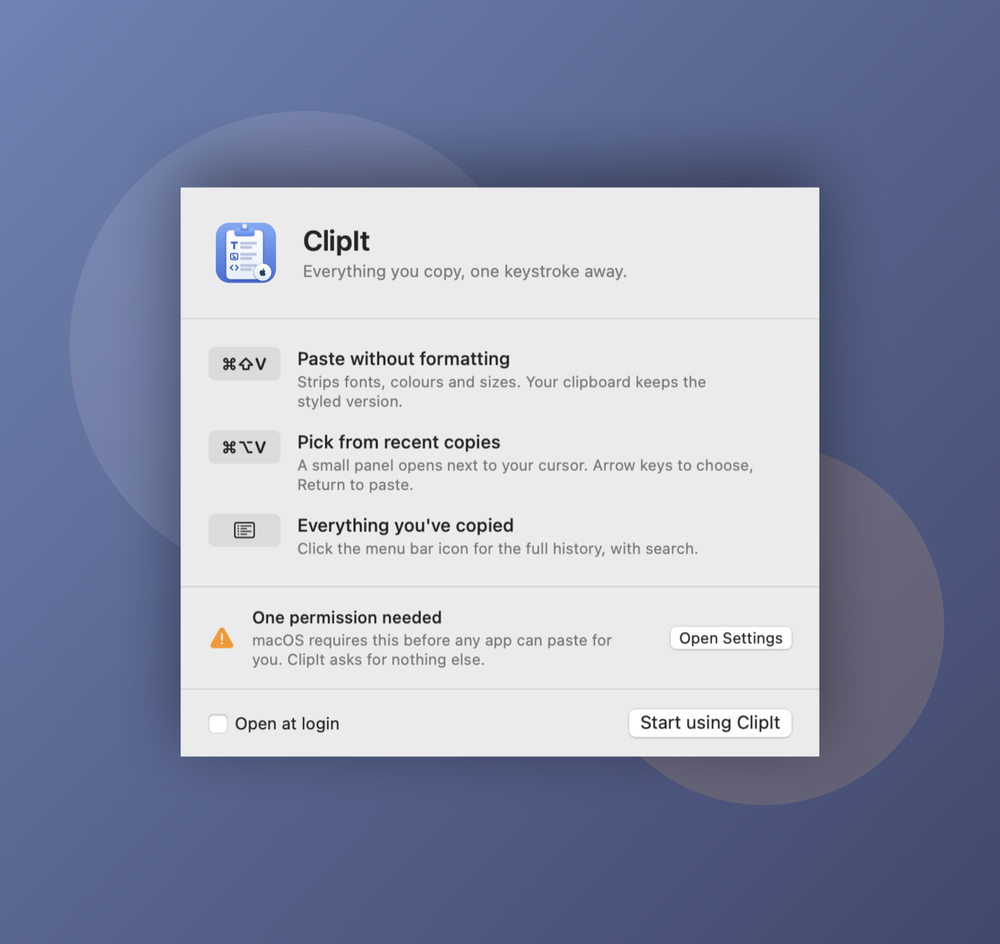
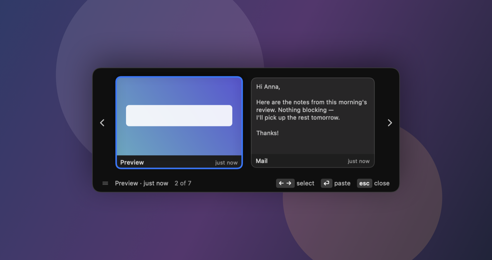
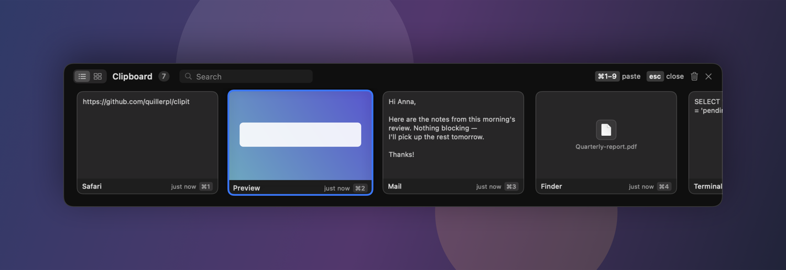

<div align="center">

# ClipIt

**Everything you copy, one keystroke away.**

A clipboard history for macOS that lives in your menu bar.
Nothing it records ever leaves your Mac — or even touches your disk.



</div>

---

## Download

### [⬇ Download ClipIt for macOS](https://github.com/quillerpl/clipit/releases/latest)

Requires macOS 14 (Sonoma) or later. Works on both Apple Silicon and Intel Macs.

### Install

1. Open the downloaded **ClipIt.dmg** and drag **ClipIt** into **Applications**.
2. Then follow the steps for your version of macOS. Not sure which you have?  → **About This Mac**.

**On macOS 15 (Sequoia) and later**

1. Open your Applications folder and double-click **ClipIt**. macOS blocks it — click **Done**.
2. Open **System Settings → Privacy & Security** and scroll down to the **Security** section.
3. Next to *"ClipIt" was blocked to protect your Mac*, click **Open Anyway**.
4. Confirm, and enter your password or Touch ID when asked.

**On macOS 14 (Sonoma)**

1. Open your Applications folder and **right-click ClipIt → Open**.
2. Click **Open** in the dialog that appears.

> **Why the extra step?**
> ClipIt isn't signed with a paid Apple developer certificate, so macOS shows an
> "unidentified developer" warning on first launch. Approving it once is how you tell macOS you
> trust it — every later launch is a normal double-click.
>
> On macOS 15 Apple removed the old right-click → Open shortcut for apps like this one, which is
> why newer systems have to take the longer route through System Settings. If you double-click
> and the dialog offers you no way forward, that's this — nothing is broken, go to
> **Privacy & Security** and look for **Open Anyway**.

ClipIt then greets you and walks through the single permission it needs.

<div align="center">

</div>

### The one permission

macOS requires **Accessibility** access before *any* app can paste on your behalf — pasting
means pressing ⌘V for you, and macOS treats that as controlling your computer.

ClipIt asks for nothing else. No network access, no files, no contacts. Recording your
clipboard works without the permission; only pasting is blocked.

---

## What it does

Copy things as you normally would. ClipIt quietly keeps the last 50, and gives you three ways
to get them back.

### ⌘⇧V — paste without formatting

Strips fonts, sizes and colours, so pasted text takes on the style of wherever it lands. Your
clipboard keeps the styled version, so a normal ⌘V still works right afterwards.

### ⌘⌥V — pick from recent copies

A small panel appears **next to your cursor**, not in the middle of the screen. `←` `→` to
choose, `⏎` to paste, `esc` to close. Drag it aside if it covers something.

It opens on your **previous** copy — the one a plain ⌘V *won't* give you — so ⌘⌥V then `⏎`
pastes the thing before last, and `←` steps back to the newest.

<div align="center">

</div>

### The menu bar icon — everything you've copied

Click it for the full history, with search. Text, images and copied files all show real
previews. Switch to card view with the toggle in the top-left for bigger previews.

<div align="center">

</div>

### Keys

| Key | Does |
|---|---|
| `↑` `↓` | Move through the list |
| `1`–`9` | Paste that row |
| `⏎` | Paste the selected item |
| `⇧⏎` | Paste it as plain text |
| `⌘F` | Search |
| `esc` | Close |
| `⌘1`–`⌘9` | Paste that card (card view only) |

---

## Privacy

- **Nothing is written to disk.** History lives in memory. Quitting ClipIt or restarting your
  Mac clears it completely — the same way Windows' clipboard history behaves.
- **Nothing is sent anywhere.** ClipIt has no network code beyond checking for its own updates.
- **Password managers are skipped.** Anything 1Password, Bitwarden or KeePassXC marks as a
  secret is never recorded.

---
---

<div align="center">

## For developers

*Everything below is for people building or modifying ClipIt.*

</div>

## Building from source

Requires macOS 14+ and Xcode 16.

```bash
git clone https://github.com/quillerpl/clipit.git
cd clipit
./make-signing-cert.sh   # one-time — see "Accessibility keeps re-asking" below
./build.sh               # builds, installs to /Applications, launches
```

```bash
swift test               # 47 tests
./release.sh             # universal build + DMG + signed update feed
```

`release.sh --notarize` also submits to Apple, which removes the right-click-to-open step for
everyone. It needs the paid Apple Developer Program plus `CODESIGN_IDENTITY` and
`NOTARY_PROFILE` — see the header of [release.sh](release.sh).

### Layout

```
Sources/ClipItKit/          everything: capture, paste, hotkeys, panels
  ClipboardMonitor.swift      changeCount polling + capture rules
  ClipboardStore.swift        in-memory history, dedupe, search
  ClipboardItem.swift         one snapshot: representations, thumbnail, display strings
  Paster.swift                pasteboard writes, focus restore, synthesized ⌘V
  HotKeyManager.swift         Carbon RegisterEventHotKey wrapper
  CaretLocator.swift          finds the insertion point via the Accessibility API
  IconRenderer.swift          draws the app icon at every size
  SnapshotRenderer.swift      renders the screenshots in this README
  Views/                      history list, card drawer, switcher, welcome
Sources/ClipIt/             thin executable shell
Tests/ClipItKitTests/       capture rules, store, search, layout maths
```

The library/executable split exists so the tests can reach the code — testing an executable
target directly is fragile across toolchains.

Two developer-only flags, both used by `build.sh` and CI:

```bash
ClipIt --make-icon <dir>    # renders the iconset
ClipIt --snapshot <dir>     # renders this README's screenshots
ClipIt --check-trust        # prints what the Accessibility API actually reports
```

---

## Accessibility keeps re-asking, or the switch is on but nothing pastes

This is the one genuinely confusing failure mode, and it is macOS's doing.

macOS ties the Accessibility grant to an app's **code signature**. An ad-hoc signature gets a
new hash on every build, so after rebuilding, the System Settings switch stays visibly ON while
the app is actually denied.

- `make-signing-cert.sh` creates a self-signed `ClipIt Dev` certificate, giving the app one
  stable identity so the grant sticks. `codesign` accepts an *untrusted* self-signed
  certificate, so this changes no system trust settings and never asks for your password.
  Note that `security find-identity -v -p codesigning` will not list it — look it up with
  `security find-certificate -c` instead.
- `build.sh` installs to `/Applications` deliberately: TCC grants are unreliable for apps on
  external volumes mounted `noowners`.

To see what macOS actually thinks, rather than trusting the switch:

```bash
/Applications/ClipIt.app/Contents/MacOS/ClipIt --check-trust
```

If it prints `false` while the switch is on, remove ClipIt from the Accessibility list with
**–**, then re-add it with **+**.

**Greyed out in the Accessibility file picker?** Either it's already in the list (the picker
disables apps that are), or the bundle isn't registered with LaunchServices — `cp` doesn't do
that. `build.sh` runs `lsregister`; by hand it's:

```bash
/System/Library/Frameworks/CoreServices.framework/Frameworks/LaunchServices.framework/Support/lsregister -f /Applications/ClipIt.app
```

---

## Deliberate choices

**Memory-only.** History is never persisted. Sleep does *not* clear it — the app keeps running
across sleep, and wiping on every screen-off would make the feature useless.

**History has a byte budget, not just an item cap.** Fifty items is no protection when one of
them is a screenshot. Memory-only means RAM *is* the storage, so `ClipboardStore` also evicts
the oldest entries past ~150 MB — "memory-only" turning into "memory hog" would discredit the
privacy claim it exists to support.

**⌘⌥V opens on the previous copy, not the newest.** Index 0 is what a plain ⌘V already pastes,
so opening there would make the switcher a slower ⌘V. It starts one back, the way ⌘Tab starts
on the previous app rather than the one you're already in.

**Updates install when you quit.** Sparkle's usual "Install and Relaunch" would restart the app
and take the whole history with it, so ClipIt downloads updates quietly and lets them land on
next launch. A small dot appears beside the menu bar icon while one is waiting, and the menu
item becomes *Quit and Update ClipIt* — the point being that you choose the moment. Choosing
*Check for Updates…* by hand still offers the immediate install; that one is a deliberate
choice, and it says "Relaunch" on the button.

The dot sits *beside* the glyph rather than on it. `doc.on.clipboard` is a solid shape, so a
black badge on its corner is invisible against black, and the transparent gap needed to separate
them reads as a bite out of the icon — see `StatusItemIcon`.

**⌘⇧V is taken over globally.** Several apps use it for "Paste and Match Style"; ClipIt's
version does the same thing, and adds it to apps that lack it. To change it, edit
`registerHotKeys()` in [AppDelegate.swift](Sources/ClipItKit/AppDelegate.swift).

**Carbon hotkeys, not a CGEventTap.** `RegisterEventHotKey` needs no permission, so the
shortcuts work the moment you launch, before you've been to System Settings.

**No ⌘N shortcuts in the ⌘⌥V switcher.** It floats over another app that still owns most of the
keyboard, so ⌘2 there would reach that app and switch its tab instead. The card drawer is a key
window and does consume them, so it keeps its badges.

---

## Gotchas worth knowing before you change things

**"Copy Image" outranks its own URL.** Browsers put an image *and* its source URL on the
pasteboard. An entry with bitmap data plus nothing but a bare URL is classified as an image —
otherwise a copied picture shows up as a link.

**One bitmap flavour, never two.** Apps put the same pixels on the pasteboard as PNG *and* as
uncompressed TIFF — tens of megabytes of the latter for a Retina screenshot. Capture keeps only
the PNG (transcoding a TIFF-only copy), and `Paster` synthesizes the TIFF back on the way out
for apps that read nothing else. Entries also never retain the decoded full-size bitmap: the
largest thing that ever shows a clip is a 208pt card, so `thumbnail` is all any view needs and
pasting reads the raw representations anyway.

**Hover only counts when the pointer actually moved.** Arrow keys scroll the list, which slides
a different row under a resting cursor; SwiftUI calls that a hover, and the selection would snap
straight back to the mouse. `PointerGate` compares the pointer's location so each input wins
while it is the one being used.

**Copied image files need Quick Look.** Copying a photo in Finder puts a file URL on the
pasteboard, not a bitmap. `requestQuickLookThumbnail()` fetches a real preview asynchronously,
which is why `ClipboardItem` is an `ObservableObject`.

**Panels read `visibleItems`, never `items`.** Otherwise the search filter desynchronises the
rows from the ⌘N indices and ⌘3 pastes the wrong thing.

**Dimmed text needs explicit opacities.** SwiftUI's `.secondary`/`.tertiary` are tuned for
opaque windows and wash out over a translucent one.

**`isMovableByWindowBackground` isn't enough** to drag a SwiftUI-hosted panel — the hosting
view swallows the mouseDown. `WindowDragHandle` forwards it to `performDrag`.

**The paste waits for you to let go.** The hotkey fires while ⌘⇧ are still held, so posting ⌘V
immediately would land as ⌘⇧V and re-trigger the app.

**Hardened runtime is only enabled for Developer ID builds.** It turns on library validation,
which requires every loaded framework to share the host's Team ID — a self-signed certificate
has none, so the embedded Sparkle would fail to load at launch.

**Release builds must be universal.** An arm64-only binary simply refuses to open on an Intel
Mac, with no useful explanation for whoever you sent it to.

---

## Changes

### 0.1.0 — first release

- Clipboard history in the menu bar: text, images and copied files, last 50 items.
- **⌘⇧V** pastes without formatting, leaving your clipboard's styled version intact.
- **⌘⌥V** opens a switcher next to your text cursor; arrow keys to choose, Return to paste.
- List view and a wide card view with previews, toggled from either panel.
- Search across content, filenames and source app (**⌘F**).
- Memory-only: nothing is written to disk, and history clears when you quit or restart.
- Copies marked secret by password managers are never recorded.
- Open at login, first-run welcome window, and automatic update checks via Sparkle.

Full history in [CHANGELOG.md](CHANGELOG.md).

---

## Licence

[MIT](LICENSE).
